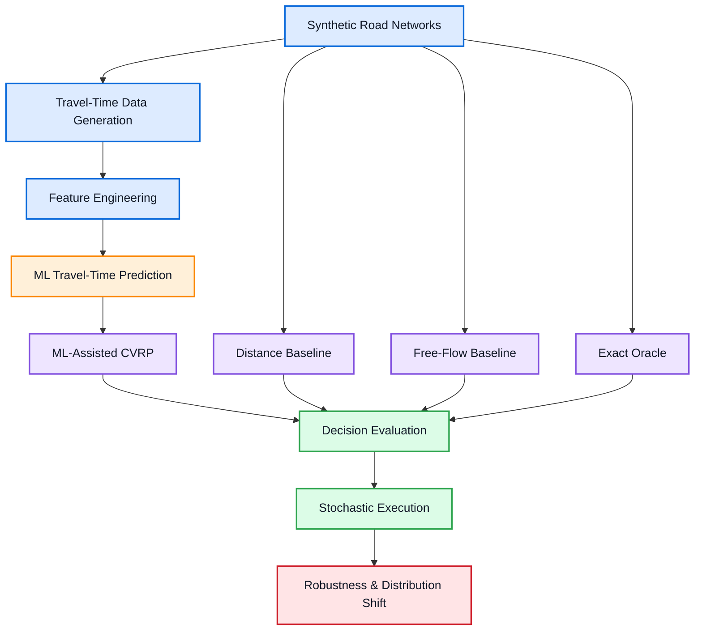
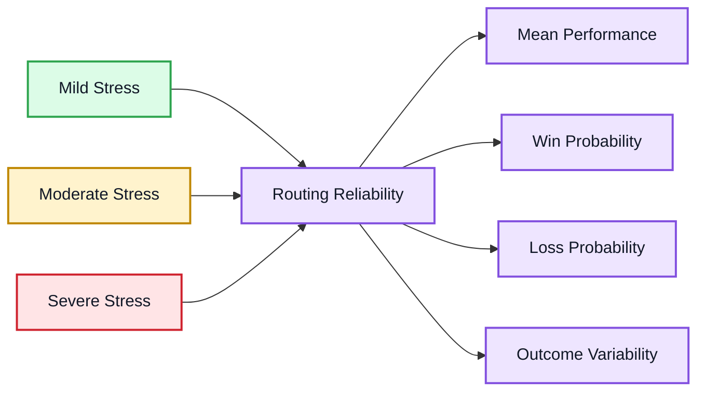
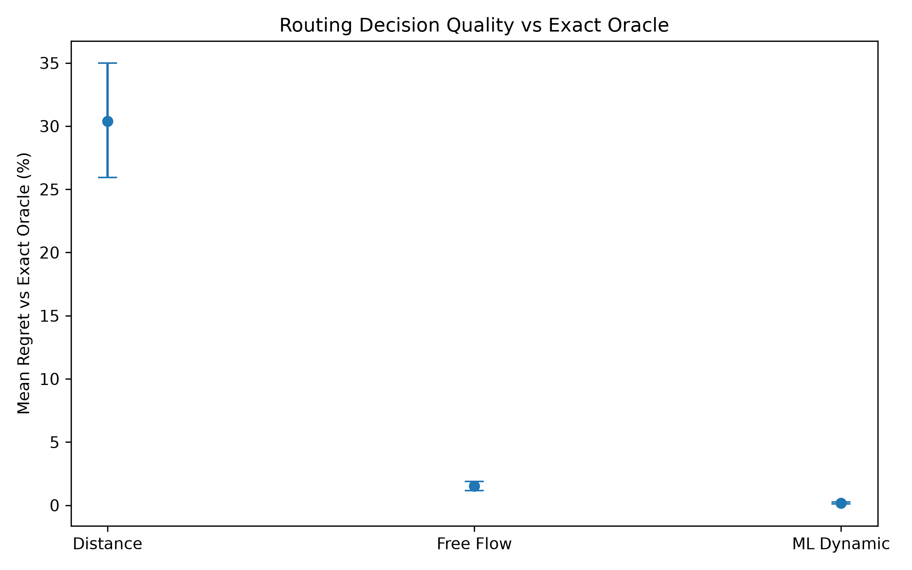
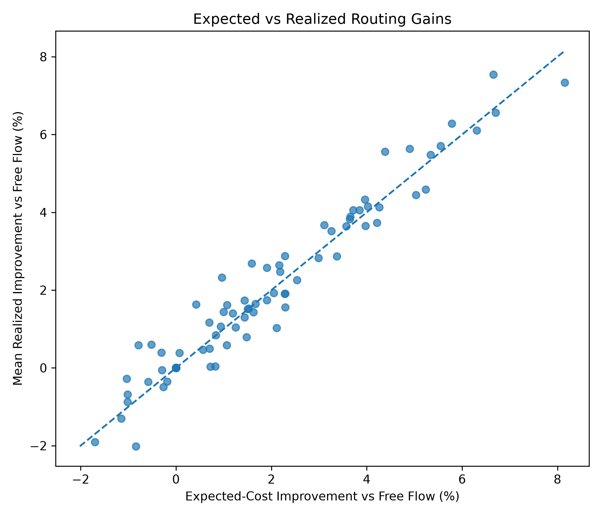
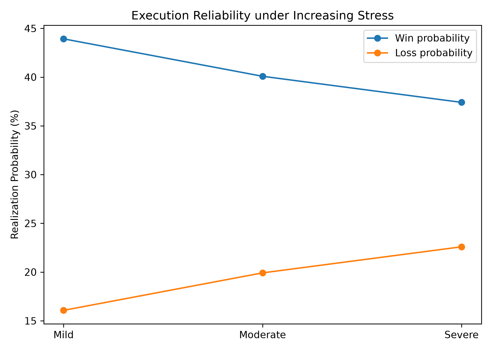
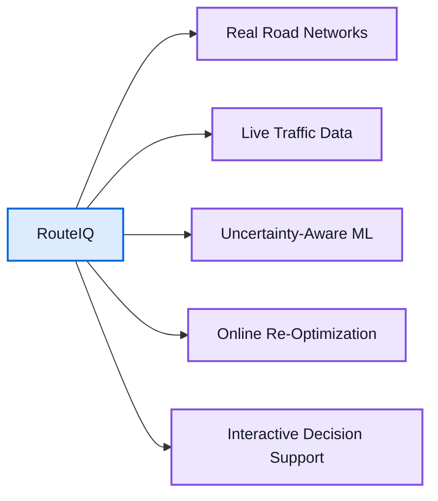

<div align="center">

# RouteIQ

### ML-Assisted Vehicle Routing & Delivery Optimization

**From travel-time prediction to better routing decisions.**

<br>

<p>
  
  
  
  
  
</p>

<br>

<p>
  
  
  
  
</p>

</div>

---

## Overview

RouteIQ is an end-to-end **machine learning and operations research project** built around one central question:

> **If travel time can be predicted more realistically, can a routing optimizer make better delivery decisions?**

Traditional routing models often optimize using distance or free-flow travel time. RouteIQ goes one step further: it predicts context-dependent travel times using information such as road type, traffic conditions, weather, and time of day, then feeds those predictions directly into a Capacitated Vehicle Routing Problem (CVRP) optimization pipeline.

The project is designed around **decision quality, not prediction accuracy alone**. Predictions are evaluated by the routing decisions they produce and compared against distance-based routing, free-flow travel-time routing, and an exact oracle benchmark.

RouteIQ then extends this evaluation into stochastic execution and controlled distribution shift to study whether those routing decisions remain effective when operating conditions become uncertain.

---

## Key Results

<div align="center">

<table>
<tr>
<td align="center" width="33%">

### 2.07 min

**Travel-Time MAE**

R² = 0.9896

</td>
<td align="center" width="33%">

### +22.29%

**vs Distance Routing**

mean route-cost improvement

</td>
<td align="center" width="33%">

### +1.29%

**vs Free-Flow Routing**

mean route-cost improvement

</td>
</tr>

<tr>
<td align="center">

### 0.17%

**ML Oracle Regret**

mean decision regret

</td>
<td align="center">

### 1.52%

**Free-Flow Oracle Regret**

mean decision regret

</td>
<td align="center">

### 93 / 120

**Exact Oracle Matches**

77.5% of scenarios

</td>
</tr>
</table>

</div>

> **Decision-level result:** ML-assisted routing reduced mean oracle regret from **1.52% to 0.17%** while retaining a **1.34% realized improvement over free-flow routing** under stochastic execution.

Across **120 routing scenarios on 30 independently generated networks**, ML-assisted routing outperformed the distance baseline in 119 scenarios.

Under stochastic execution, the ML-based decisions retained an average **1.34% realized improvement over free-flow routing**, with a cluster-bootstrap 95% confidence interval of **[1.01%, 1.67%]**.

---

## How It Works

RouteIQ connects predictive machine learning with prescriptive optimization inside a unified decision-evaluation pipeline.



The pipeline deliberately separates **prediction quality** from **decision quality**. A predictive model is useful only if its estimates cause the optimizer to select better routes.

RouteIQ compares four routing strategies:

| Strategy | Cost Information | Role |
|---|---|---|
| **Distance** | Geometric distance | Simple baseline |
| **Free-Flow** | Uncongested travel-time estimate | Strong operational baseline |
| **ML-Assisted** | Context-aware predicted travel time | Proposed decision strategy |
| **Exact Oracle** | True scenario travel time | Decision-quality benchmark |

---

## Methodology

### Optimization

RouteIQ builds the optimization layer progressively, moving from exact small-instance methods toward scalable vehicle-routing approaches.

The optimization stack includes:

- **Brute-force search** for exact small-instance baselines
- **Clarke-Wright savings** as a fast constructive heuristic
- **Google OR-Tools** for scalable vehicle routing
- **Gurobi** for mathematical optimization and exact benchmarking

The solvers are evaluated across problem sizes, computational budgets, repeated seeds, and time limits to compare both **solution quality** and **runtime behavior**.

---

### Machine Learning

Synthetic trip observations are generated from road-network and environmental conditions.

The predictive pipeline incorporates factors including:

```text
Distance
   +
Road Type
   +
Traffic Conditions
   +
Weather
   +
Temporal Context
   ↓
Predicted Travel Time
```

Multiple regression approaches are benchmarked before selecting and tuning the final travel-time model.

<div align="center">

| Metric | Held-Out Test Result |
|:---|---:|
| **MAE** | **2.066 min** |
| **RMSE** | **2.623 min** |
| **R²** | **0.9896** |
| **MAE improvement vs Dummy** | **89.73%** |

</div>

These predictive metrics are treated as an intermediate result rather than the final objective of the project.

---

### Predict-then-Optimize

The central RouteIQ experiment asks whether improved predictions produce improved decisions.


For every scenario, the same CVRP is solved using:

- distance,
- free-flow travel time,
- ML-predicted travel time,
- exact scenario travel time.

The exact solution serves as an **oracle**, allowing decision quality to be evaluated through route cost, regret, win/loss behavior, and exact objective matches.

This is the core distinction of RouteIQ:

> **The ML model is evaluated as part of a decision system, not only as a regression model.**

---

### Stochastic Evaluation

Expected travel times do not guarantee realized operational performance.

RouteIQ therefore executes the selected routes repeatedly under stochastic travel-time realizations.

<div align="center">

| Stochastic Evaluation | Result |
|:---|---:|
| Total realizations | **12,000** |
| Realized ML improvement vs free-flow | **+1.34%** |
| 95% cluster-bootstrap CI | **[1.01%, 1.67%]** |
| Pearson expected-vs-realized correlation | **0.977** |
| Spearman correlation | **0.936** |

</div>

The strong expected-versus-realized relationship indicates that the decision-quality improvements persist beyond deterministic expected-cost comparisons.

---

### Robustness & Distribution Shift

RouteIQ also evaluates how routing decisions respond to increasingly uncertain execution environments.



The central robustness finding is subtle:

> **Average ML advantage remains relatively stable as stress increases, but decision-level reliability deteriorates.**

This means stable average performance does not automatically imply stable operational reliability.

---

## Results

### Decision Quality vs Exact Oracle

The most important evaluation is not whether the ML model predicts travel time accurately, but whether those predictions produce routing decisions close to the exact optimum.

<p align="center">
  
</p>

<div align="center">

| Routing Strategy | Mean Oracle Regret |
|:---|---:|
| Distance | **30.40%** |
| Free-Flow | **1.52%** |
| **ML-Assisted** | **0.17%** |

</div>

ML-assisted routing therefore closes most of the decision-quality gap between a practical predictive cost model and perfect scenario information.

---

### Performance Across Operating Scenarios

The benefit over the strong free-flow baseline varies by operating regime.

<div align="center">

| Scenario | ML Improvement vs Free-Flow |
|:---|---:|
| Weekday Midday | **+0.99%** |
| Weekday Rush | **+1.91%** |
| Weekend Evening | **+1.79%** |
| Weekend Midday | **+0.46%** |

</div>

This variation suggests that context-aware prediction becomes most valuable when operating conditions differ materially from free-flow assumptions.

---

### Expected vs Realized Performance

<p align="center">
  
</p>

Expected scenario-level gains strongly predict realized stochastic gains, with a Pearson correlation of **0.977**.

---

### Reliability Under Distribution Shift

<p align="center">
  
</p>

As stress increases from mild to severe:

- mean improvement remains close to **1.28%**,
- conditional ML win probability decreases,
- loss probability increases,
- realized route-cost variability rises substantially.

The stress tests therefore separate **average effectiveness** from **operational reliability**.

---

## Repository Structure

```text
RouteIQ/
│
├── src/
│   └── routeiq/                 Core reusable package
│
├── experiments/
│   ├── optimization/            Solver and scaling experiments
│   ├── ml/                      ML training and evaluation
│   ├── predict_optimize/        Decision-quality experiments
│   └── robustness/              Stochastic and stress testing
│
├── analysis/
│   ├── optimization/
│   ├── ml/
│   ├── predict_optimize/
│   └── robustness/
│
├── visualization/
│   ├── optimization/
│   ├── predict_optimize/
│   └── robustness/
│
├── results/
│   ├── optimization/
│   ├── ml/
│   ├── predict_optimize/
│   └── robustness/
│
├── data/                        Generated experiment input
├── tests/                       Automated test suite
│
├── pyproject.toml
├── requirements.txt
└── README.md
```

The repository separates **reusable source code**, **experimental workflows**, **analysis**, **visualization**, and **generated results**.

---

## Installation

Clone the repository and create a virtual environment:

```bash
git clone https://github.com/kemalUludag/RouteIQ.git
cd RouteIQ

python3 -m venv .venv
source .venv/bin/activate
```

Install RouteIQ in editable mode:

```bash
pip install -e ".[dev]"
```

Generate the synthetic trip dataset:

```bash
python3 -m experiments.ml.prepare_trip_data
```

> Gurobi-based experiments may require an appropriate local Gurobi license depending on the optimization model being solved.

---

## Reproducing Representative Experiments

Evaluate the final ML model:

```bash
python3 -m experiments.ml.evaluate_final_ml_model
```

Run the predict-then-optimize demonstration:

```bash
python3 -m experiments.predict_optimize.run_predict_optimize_demo
```

Analyze final predict-then-optimize results:

```bash
python3 -m analysis.predict_optimize.analyze_predict_optimize_final
```

Analyze stochastic route execution:

```bash
python3 -m analysis.robustness.analyze_stochastic_route_evaluation
```

Analyze distribution-shift stress tests:

```bash
python3 -m analysis.robustness.analyze_robustness_stress_test
```

---

## Testing

RouteIQ includes automated tests covering:

```text
Routing Algorithms
Optimization Interfaces
Travel-Time Modeling
Machine Learning Utilities
Predict-then-Optimize Evaluation
Robustness Simulation
Result Analysis
```

Run the complete test suite:

```bash
python3 -m pytest
```

<div align="center">


</div>

---

## Limitations

RouteIQ is currently evaluated in a **controlled synthetic environment**.

The road networks, traffic effects, weather effects, and distribution-shift stress levels are generated for experimental evaluation and are **not calibrated to a specific real-world transportation system**.

The results should therefore be interpreted as evidence about the behavior of the RouteIQ framework under controlled conditions rather than as claims about production logistics performance.

---

## Future Work



Potential extensions include real-world traffic data, larger routing instances, probabilistic travel-time prediction, online re-optimization, and an interactive decision-support interface.

---

<div align="center">

### Prediction → Optimization → Execution → Decision Quality

**RouteIQ evaluates the full decision pipeline rather than prediction accuracy in isolation.**

</div>
